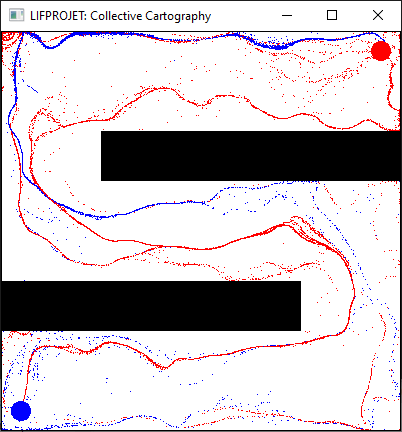

# LIFPROJET: Cartographie Collective



Soutenance vidéo([partie 1](https://youtu.be/gwrDPerpsmI), [partie 2](https://youtu.be/h3nHl_5VpXQ))

L'intelligence collective désigne la capacité d'une communauté à faire converger intelligence et connaissances pour avancer vers un but commun.
Elle résulte des interactions entre ses membres (ou agents).
Alors que la connaissance des agents est limitée, dont leur perception de l'environnement et leur conscience de la totalité des éléments pertinents,
de comportements simples peuvent émerger la résolution de tâches complexes.

Ce projet tente alors de proposer un modèle minimal pour l'intelligence collective et s'incrit dans la lignée des travaux de modélisations de phénomènes naturels -
tels que les Boids de Craig W. Reynolds.
Le champ d'application est large: modélisation pour l'informatique graphique, génération procédurale, microrobotique, etc.

# Compilation et Execution

Nécessite CMake et SFML 2.5.

```
cmake -DCMAKE_BUILD_TYPE:STRING=Release .
cmake --build .
main <scenario>
```

Le développement s'est effectué sous MSVC 19.24.

## Scénarios

Les scénarios suivant sont peuvent être chargé via la ligne de commande.

- emission_1
- collision_1, collision_2
- eloignement_1, eloignement_2
- rapprochement_1
- trajet_1, trajet_2
- demonstration_1, demonstration_2

##  Contrôles

Barre d'espace : Lancer la simulation / Pause.

+, - : Accélérer / Décélerer la simulation.

A, Z, E, R, T : Mettre en valeur des colonies.

Pavé numérique 1, 2, 3, 4, 5 : Afficher les milieux associés.
